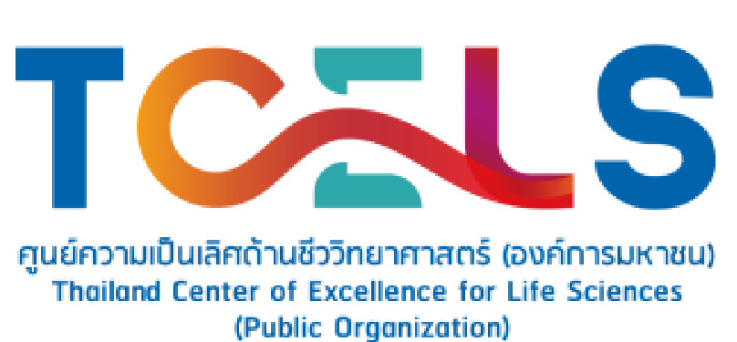

# Introduction to OMOP/OHDSI (in Thai 🇹🇭)

This book/website compiles basic details about OMOP CDM and OHDSI for those interested in further study or wanting to start using OMOP CDM and OHDSI in medical research projects. Publicly accessible at: [https://omop.sidata.plus/](https://omop.sidata.plus/)

Maintained by the Siriraj Informatics and Data Innovation Center (SiData+), Faculty of Medicine Siriraj Hospital, Mahidol University.

Supported by the Thailand Center of Excellence for Life Sciences (TCELS), project code TC (ERP) 13/2566.

## Requirements

- [Quarto CLI](https://quarto.org/docs/get-started/)

## Instructions

1. Clone this repository
2. Edit contents in `chapters/` directory
3. Run `quarto preview` to preview the website live
4. Run `quarto render` to render the website as static files
5. Any updates to the `main` branch will be automatically deployed to [https://omop.sidata.plus/](https://omop.sidata.plus/) via [GitHub Actions](https://github.com/sidataplus/omop-book/actions). The static files are stored in the `gh-pages` branch.

## More information

- [Quarto Documentation on Book](https://quarto.org/docs/books/)
